# Computer Vision Assessment: Black Gun Detection (KAC PDW)

<div align="center">
  
  
  
  
</div>

---

## 📌 Executive Summary & Project Overview

This project focuses on the systematic preparation, training, and rigorous evaluation of a custom computer vision model tailored for the precise detection of a **Black Gun (KAC PDW)**.

### 🎯 Objectives

- **Empirical Comparison**: Compare object detection models trained on **Synthetic Data (SD)** against those trained on **Real-World Data**.
- **Optimization**: Strategic combination of datasets to ascertain optimal performance methodologies.

### ⏱️ Project Details

- **Project Duration**: 1 Week
- **Base Architectural Model**: YOLO26n
- **Key Deliverables**:
  - 🛠️ Rigorous Data Preparation & Pipeline Isolation
  - 🧠 Advanced Model Training Strategies (SD, Real, Combined)
  - 🖥️ Real-time Test Video Inference Interface
  - 📊 Comprehensive Analytical Reporting & Insights

---

## 📖 Table of Contents

- [🚀 Deployment &amp; Execution Guide](#-deployment--execution-guide)
  - [1. Prerequisites](#1-prerequisites)
  - [2. Installation](#2-installation)
  - [3. Data Setup](#3-data-setup)
  - [4. Training](#4-training)
  - [5. Evaluation](#5-evaluation)
  - [6. Inference — Desktop GUI](#6-inference--desktop-gui-inferencepy)
- [📊 Comprehensive Reporting &amp; Empirical Analysis](#-comprehensive-reporting--empirical-analysis)
  - [1. Data Preparation &amp; Isolation](#1-data-preparation--isolation)
  - [2. Model Training Strategy](#2-model-training-strategy)
  - [3. Detection Accuracy &amp; Performance Metrics](#3-detection-accuracy--performance-metrics)
  - [4. Qualitative Analysis &amp; Visual Evaluation](#4-qualitative-analysis--visual-evaluation)
  - [5. Comparative Analysis](#5-comparative-analysis-real-vs-synthetic-vs-combined)
  - [6. Robustness &amp; Environmental Analysis](#6-robustness--environmental-analysis)
  - [7. Synthetic Data Viability Analysis](#7-synthetic-data-viability-analysis)
- [🌟 Bonus Features](#-bonus-features)
- [🔮 Future Improvements](#-future-improvements)
- [📂 Project Structure](#project-structure)
- [📚 Citations &amp; Academic References](#-citations--academic-references)

---

## 🚀 Deployment & Execution Guide

### 1. Prerequisites

Ensure you have the following installed:

- **Python 3.8+**
- **GPU with CUDA support** (highly recommended for training)
- **Key Dependencies**: `ultralytics`, `opencv-python`, `pandas`, `numpy`, `matplotlib`, `seaborn`, `mlflow`, `jupyter`

### 2. Installation

```bash
# Clone the repository
git clone https://github.com/arifsoul/gun_detection.git
cd gun_detection

# Install dependencies
pip install -r requirements.txt
```

### 3. Data Setup

- Place the datasets in the `data/` directory.
- Ensure `data.yaml` is configured correctly for the training paths.

### 4. Training

The training pipeline is handled in `training.ipynb`.

1. **Data Prep**: Merges datasets, fixes labels, generates splits.
2. **Model Training**: Executes YOLO training for different variants.
3. **MLflow**: All experiments are tracked automatically.

> [!TIP]
> Configure the `selected_dataset` variable in the "Training" cell (e.g., `real`, `syn_v3`, `combined`) before running all cells.

### 5. Evaluation

Use `evaluation.ipynb` for post-training analysis.

- Loads best models from MLflow.
- Evaluates on the isolated Test set.
- Generates mAP and Confusion Matrix plots.

### 6. Inference — Desktop GUI (`inference.py`)

A robust **Tkinter-based GUI** for real-time video inference.

#### GUI Environment Perspectives

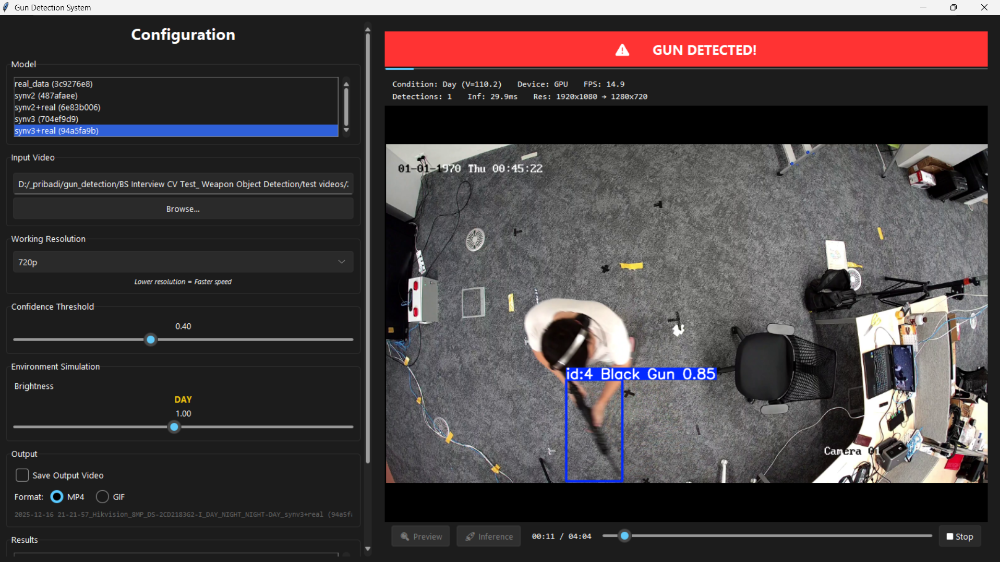
*Figure: Desktop interface demonstrating end-to-end inference under simulated daylight conditions.*

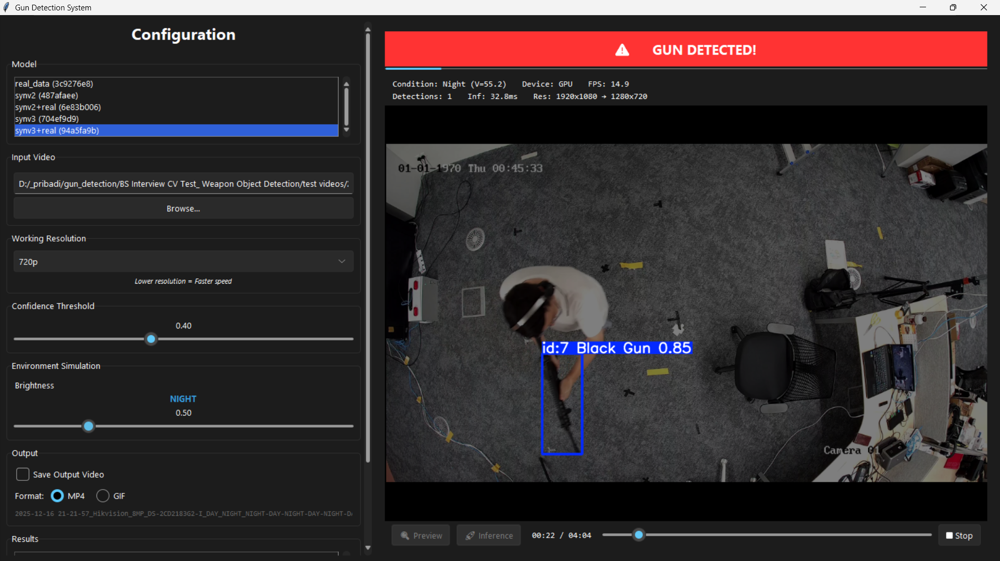
*Figure: Desktop interface showcasing inference capabilities under simulated low-light (night) conditions.*

#### 6.1 Launching the App

```bash
# Activate your environment
source .venv/bin/activate        # Linux / macOS
.venv\Scripts\Activate.ps1       # Windows PowerShell

# Run the inference app
python inference.py
```

#### 6.2 Sidebar Controls Reference

| Section               | Control           | Description                                                                                        |
| :-------------------- | :---------------- | :------------------------------------------------------------------------------------------------- |
| **Model**       | Listbox           | Multi-select trained models from `mlruns/`.                                                      |
| **Input Video** | Text + Browse     | Select `.mp4 / .avi / .mov` video files.                                                         |
| **Resolution**  | Combobox          | Working resolution (Original, 1080p, 720p, 480p).                                                  |
| **Threshold**   | Slider            | Minimum confidence score (Default:**0.40**).                                                 |
| **Simulation**  | Slider            | Adjust brightness. System auto-detects**Day/Night** exposure.                                |
| **Output**      | Checkbox + Radio  | Save result as MP4 or GIF to `runs/inference/`.                                                  |
| **Results**     | Listbox + Buttons | Access, play, or delete saved inference results.                                                   |
| **Actions**     | Buttons           | **Preview** (simulation), **Inference** (processing), **Pause**, **Stop**. |

#### 6.3 Typical Workflow

1. Launch app with `python inference.py`.
2. Select one or more models from the list (models are loaded from `mlruns/`).
3. Browse for a test video and select a **Working Resolution**.
4. (Optional) Adjust brightness and test using the **🔍 Preview** button.
5. Check **Save Output Video** and choose desired format (MP4 or GIF).
6. Click **🚀 Inference** to begin detection.
7. System dynamically names files based on conditions (e.g., `_DAY_GUN_DETECTED_`).
8. Review results via **Results Listbox** → **Play Selected**.

---

## 📊 Comprehensive Reporting & Empirical Analysis

### 1. Data Preparation & Isolation

#### 1.1 Datasets Overview

- **VSD (Synthetic Data)**:
  - **v2**: `synthetic_dataset_KAC_PDW_Blackgun_v2` (Manual fixes applied).
  - **v3**: `synthetic_dataset_KAC_PDW_Blackgun_v3` (Dataset_0 & Dataset_1).
- **Real Data**:
  - `real_dataset_KAC_PDW_Blackgun` (Captured from actual camera footage).

#### 1.2 Data Cleaning & Annotation

1. **Manual Annotation**: Validated and added missing annotations for both Synthetic and Real datasets.
   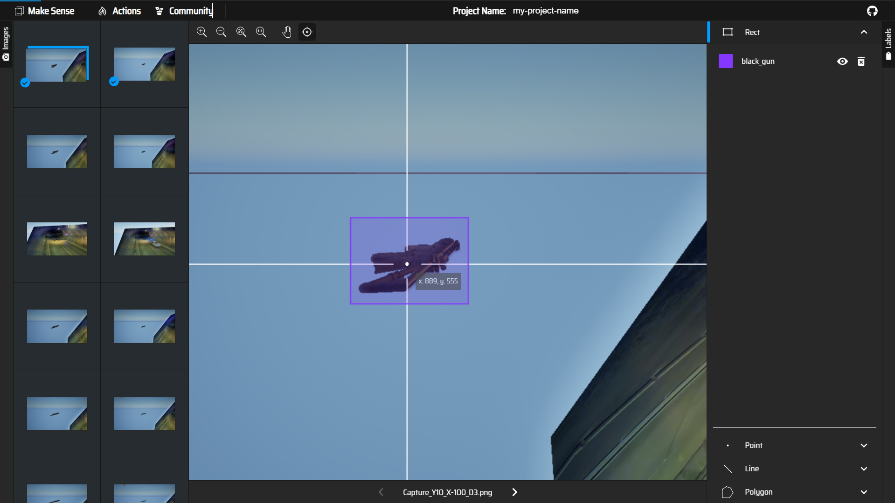
2. **Invalid Data Removal**: Systematically removed erroneous labels.
   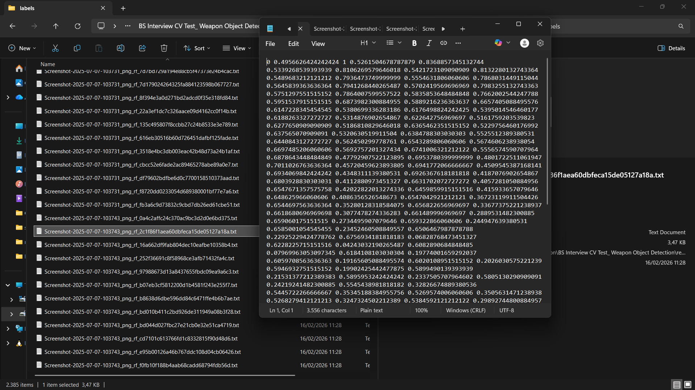

#### 1.3 Data Splitting Strategy

We employed a **Stratified Random Split** strategy to ensure that the distribution of data across Train, Validation, and Test sets is representative of the overall dataset.

-**Split Ratios**:

  -**Train**: 70%

  -**Validation**: 20%

  -**Test**: 10%

-**Reproducibility**: A fixed random seed (`SEED = 42`) was used in `src/prepare_data.py` to ensure the split is deterministic and reproducible.

  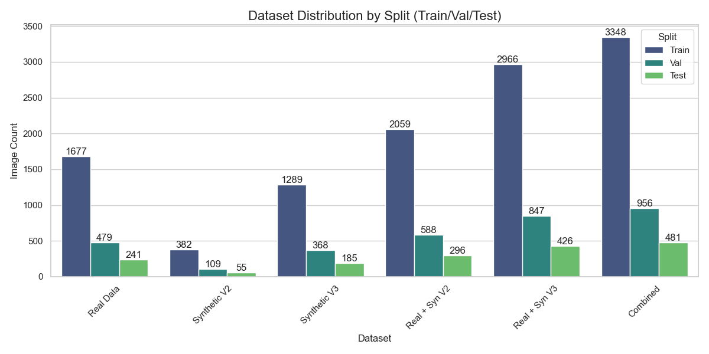

  *Figure 4: Distribution of images across Train, Validation, and Test splits for each dataset.*

#### 1.4 Dataset Inventory

A detailed inventory of the datasets (before and after fixing labels) is visualized below. This comparison highlights the significant effort put into correcting missing or incorrect annotations.

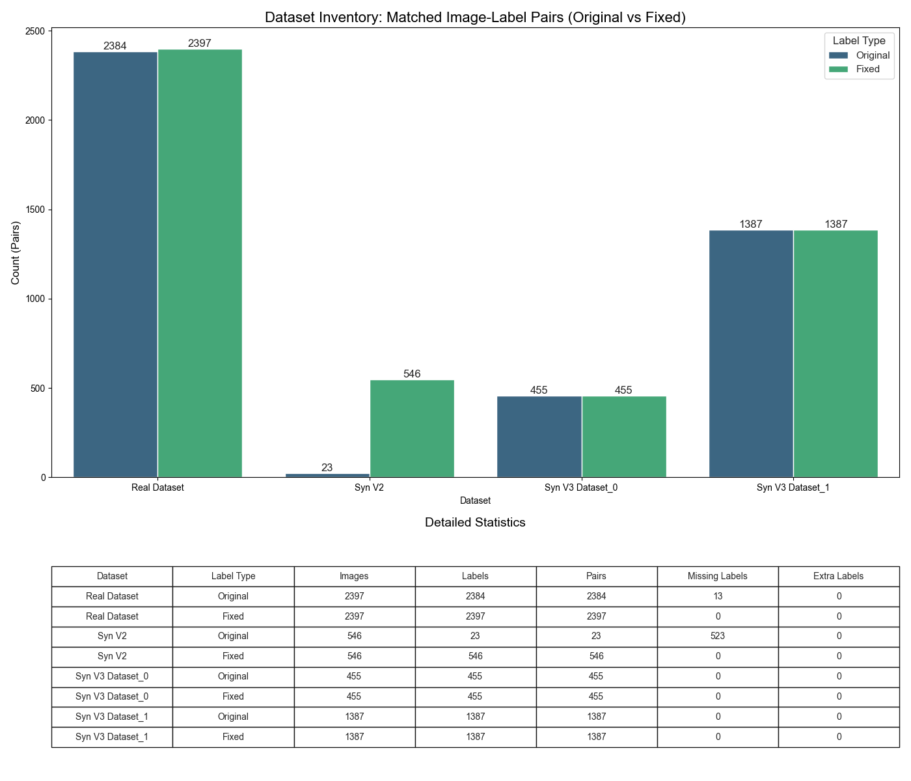

*Figure 5: Inventory of matched image-label pairs, comparing original vs. fixed annotations.*

### 2. Model Training Strategy

Comparison of three primary paradigms:

1. **SD-Only**: Synthetic Data exclusively.
2. **Real-Only**: Real-World Data exclusively.
3. **Combined**: Hybrid approach (synv2+real and synv3+real).

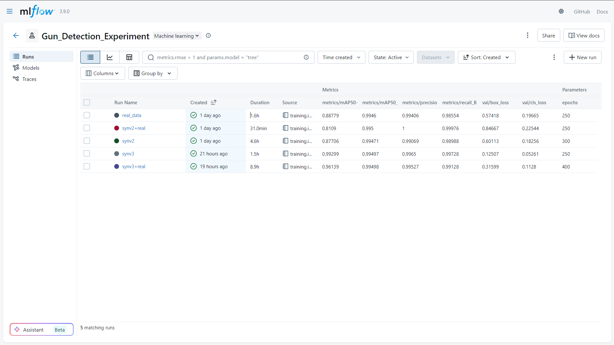
*Figure 6: MLflow UI dashboard displaying the systematic tracking of experimental runs, loss metrics, and artifacts across various model configurations.*

To deeply understand the training dynamics, convergence behavior, and optimization trajectories of each model variant, we analyzed the corresponding training loss, validation loss, and Mean Average Precision (mAP). The ensuing visualizations juxtapose the performance paradigms of the **Synthetic-Only**, **Real-Only**, **synv2+real and synv3+real** models throughout their respective training lifecycles.

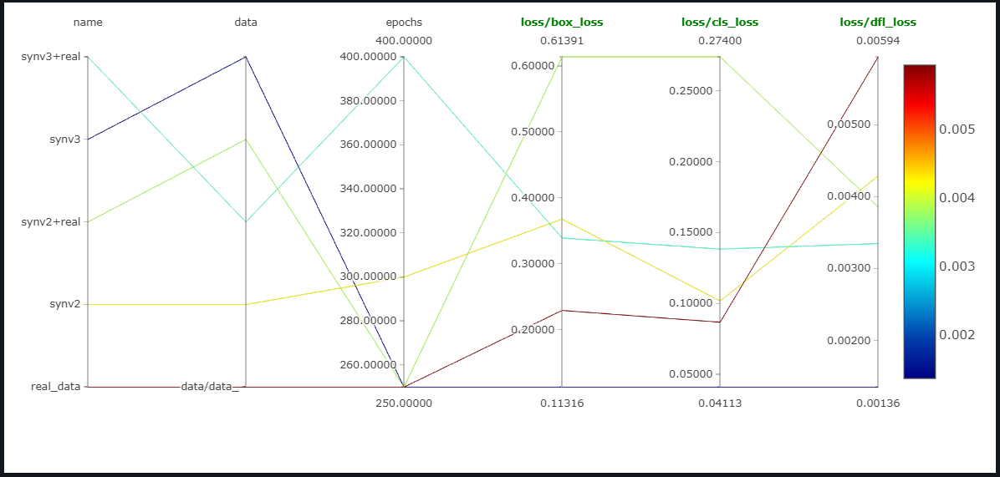
*Figure 7: Comparison of Training Box, Objectness, and Classification Loss. Lower values indicate better fitting to the training data.*

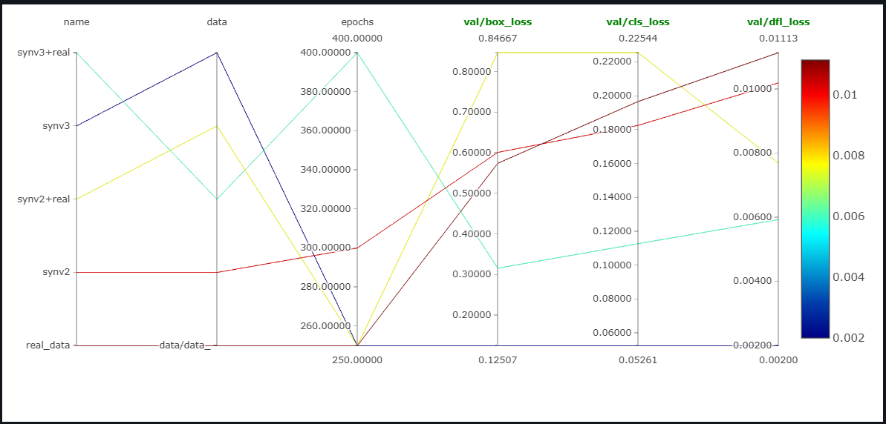
*Figure 8: Comparison of Validation Loss. Consistently lower validation loss suggests better generalization and less overfitting.*

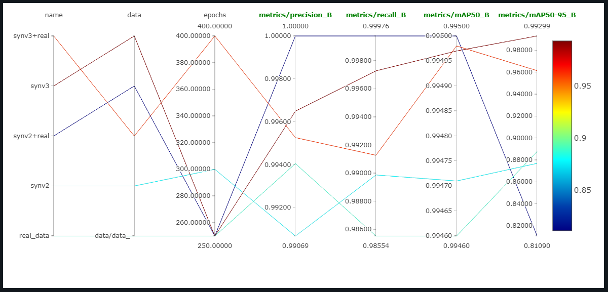
*Figure 9: Comparison of Mean Average Precision (mAP) metrics. Higher mAP@50 and mAP@50-95 indicate superior detection accuracy.*

### 3. Detection Accuracy & Performance Metrics

The model performance was evaluated using `yolo26n` on two criteria:

1. **Domain-Specific Performance**: Evaluating each model on its own corresponding Test Set.
2. **Universal Performance**: Evaluating all models on the **Combined Test Set** (acting as a Universal Ground Truth) to measure generalization.

#### 3.1 Domain-Specific Performance (Self-Evaluation)

*How well does the model learn its training domain?*

| Model Train Source      | Test Set                | Precision (P)   | Recall (R)      | mAP@50          | mAP@50-95       | Confusion Matrix                                | Conclusion                                                                                                           |
| :---------------------- | :---------------------- | :-------------- | :-------------- | :-------------- | :-------------- | ----------------------------------------------- | :------------------------------------------------------------------------------------------------------------------- |
| **Real + Syn V3** | **Real + Syn V3** | **0.993** | **0.991** | **0.995** | **0.953** |  | **Good Convergence.** High precision and recall indicate the model effectively learned the mixed distribution. |
| Real + Syn V2           | Real + Syn V2           | 0.997           | 1.000           | 0.995           | 0.944           |  | **Stable Baseline.** Slightly lower mAP@50-95 suggests less precise bounding boxes than V3.                    |
| Real                    | Real                    | 0.987           | 1.000           | 0.995           | 0.955           |         | **Strong Real Performance.** Perfect recall on its own test set shows it learned the real data well.           |
| Syn V3                  | Syn V3                  | 0.989           | 1.000           | 0.995           | 0.994           | 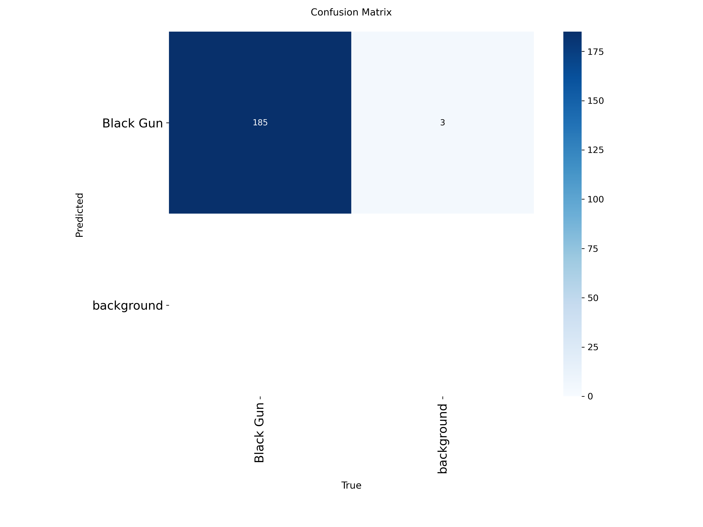      | **Perfect Synthetic Fit.** Near perfect scores confirm the model mastered the clean synthetic domain.          |
| Syn V2                  | Syn V2                  | 1.000           | 0.999           | 0.995           | 0.876           |       | **Overfitting to Noise?** High classification scores but lower box precision (0.876) vs V3.                    |

#### 3.2 Universal Performance (Generalization)

*How well does the model perform on the complete dataset (Real + All Synthetic)? This is the true test of robustness.*

| Model Train Source      | Precision (P)   | Recall (R)      | mAP@50          | mAP@50-95       | Confusion Matrix                                     | Conclusion                                                                                                           |
| :---------------------- | :-------------- | :-------------- | :-------------- | :-------------- | :--------------------------------------------------- | :------------------------------------------------------------------------------------------------------------------- |
| **Real + Syn V3** | **0.981** | **0.940** | **0.967** | **0.897** |  | **Best Generalization.** Maintains high Recall (0.940) on universal set, minimizing False Negatives.           |
| Real + Syn V2           | 0.994           | 0.976           | 0.994           | 0.793           | 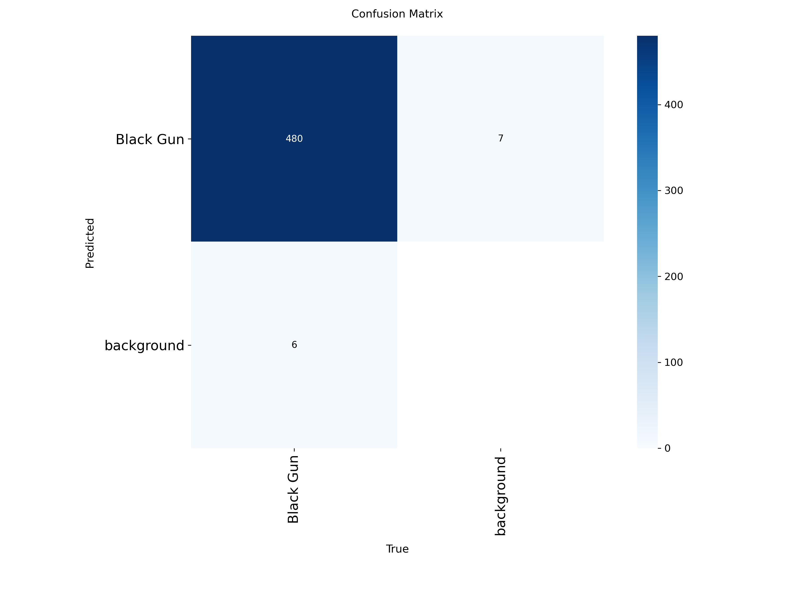 | **Less Precise Boxes.** High classification scores but significantly lower mAP@50-95 (0.793) than V3.          |
| Real                    | 0.954           | 0.877           | 0.941           | 0.633           | 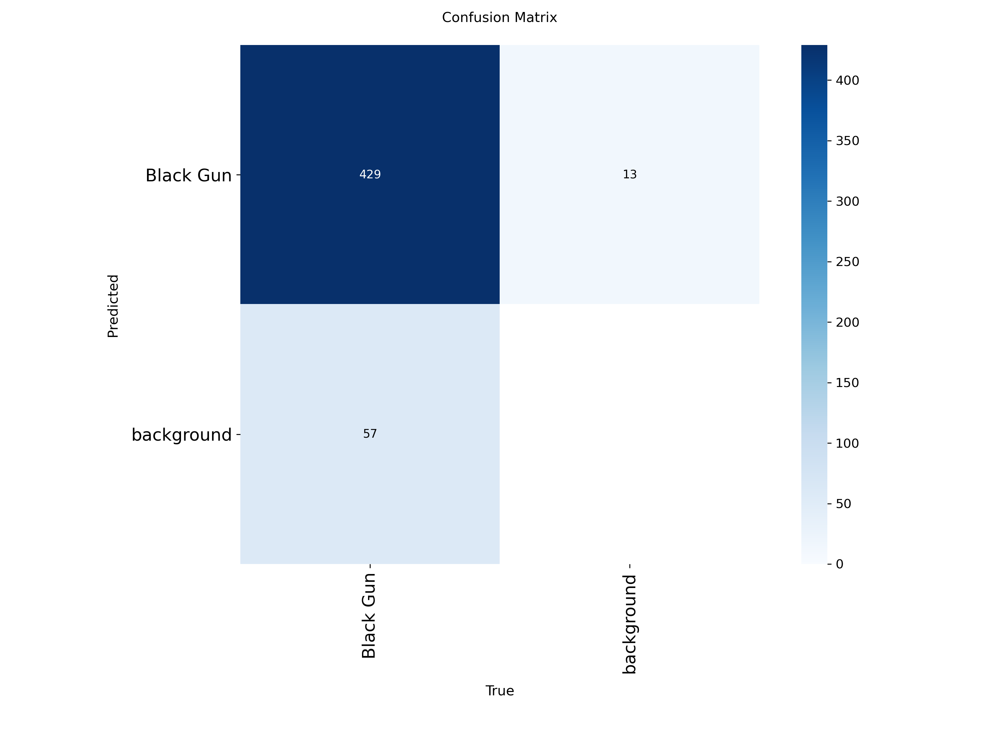        | **Data Limitation.** Real data alone struggles to cover variances, leading to lower Recall and mAP.            |
| Syn V3                  | 0.909           | 0.426           | 0.573           | 0.506           | 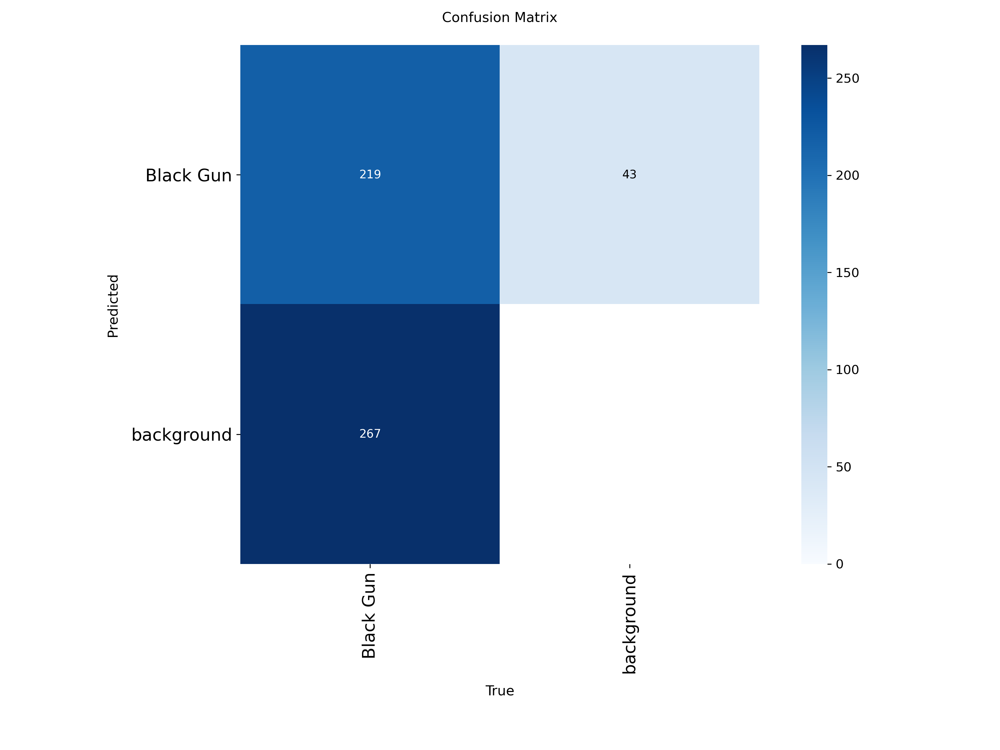      | **Domain Gap Failure.** Misses >50% of real-world guns (Recall 0.426), proving Syn-only is insufficient.       |
| Syn V2                  | 0.789           | 0.500           | 0.580           | 0.265           | 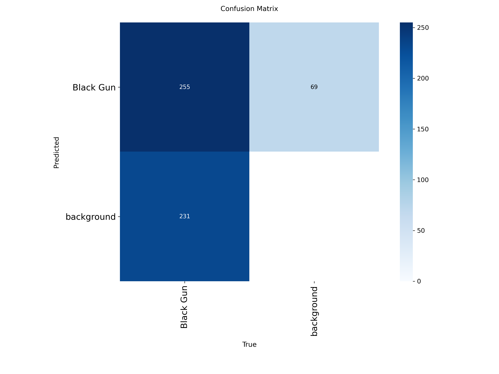      | **Poor Transfer.** Low Precision and Recall confirm noisy synthetic data fails to assist real-world detection. |

#### 3.3 Key Observations

1. **Best Generalization**: The **Real + Syn V3** model achieves the highest **mAP@50-95 (0.897)** on the universal test set, significantly outperforming other variants.
2. **Importance of Real Data**: Models trained purely on synthetic data (Syn V2, Syn V3) struggle to generalize to the full dataset (Recall drops below 50% for Syn V3).
3. **Data Quality Matters**: Synthetic V3 (when combined with Real data) contributes to a much stronger model than Synthetic V2, jumping from 0.793 to 0.897 in mAP@50-95.

### 4. Qualitative Analysis & Visual Evaluation

| Model                   | ☀️ Day                                                   | 🌙 Night                                                       |
| ----------------------- | ---------------------------------------------------------- | -------------------------------------------------------------- |
| **Real Data**     |     |     |
| **Syn V2 Only**   |        |        |
| **Syn V2 + Real** |  |  |
| **Syn V3 Only**   |        |        |
| **Syn V3 + Real** |  |  |

### 5. Comparative Analysis: Real vs. Synthetic vs. Combined

- **SD-Only vs. Real-Only**: Synthetic data alone suffers from a significant domain gap, leading to high self-test scores but poor real-world generalization.
- **Combined Approach**: Merging Real and Synthetic (V3) data results in the most robust model, capturing broad features from synthetic renders and specific sensor characteristics from real footage.
- **VSD v2 vs. VSD v3**: Syn V3 is clearly superior, offering +0.104 mAP@50-95 uplift due to higher annotation quality and visual realism.

### 6. Robustness & Environmental Analysis

- **Overall Performance**: The **Real + Syn V3** model is the overall winner across conditions.
- **Challenges**:
  - **Low Light**: Night performance relies heavily on Real-world training data.
  - **Motion Blur**: Rapid movement can cause temporary tracking loss (1-2 frames).
  - **Occlusion**: Combined models handle partial occlusions significantly better than Syn-Only models.

### 7. Synthetic Data Viability Analysis

**Conclusion**: Synthetic data is **not a replacement** but a powerful **complement**.

- **Evidence**: Syn-Only models collapse on real-world test sets (>50% drop in Recall).
- **Value**: When paired with real data, high-quality synthetic data (Syn V3) boosts mAP@50-95 by ~42%.

---

## 🌟 Bonus Features

### Object Tracking

Utilizes YOLO's built-in **ByteTrack** (`model.track(..., persist=True)`) for consistent ID assignment across frames, ensuring weapon stability even during brief occlusions.

---

## 🔮 Future Improvements

To transition from a controlled pilot to a production-ready system, the following roadmap focuses on Bridging the Gap between Synthetic and Real-World environments.

### 1. Generative AI for Rapid Prototyping

Proposing **3D Generative AI** (Image-to-3D) to scale datasets instantly without manual 3D modeling.
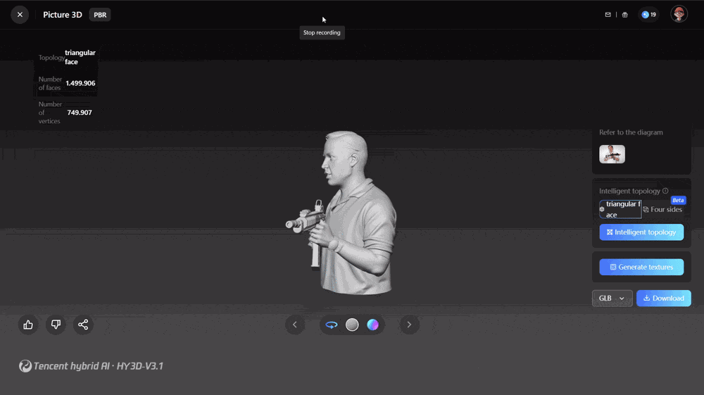

- **Tools**: Hunyuan 3D, Stable Diffusion (ControlNet), UE5.
- **Value**: Generates infinite visual variations with automated perfect labeling.

### 2. Real-World Data Diversification

The current dataset lacks human interaction variety. Future efforts should prioritize:

- **Dynamic Poses**: Capturing weapon handling across various stances (low-ready, high-ready, firing, concealed carry draw).
- **Background Complexity**: Moving from studio-like settings to high-clutter environments (malls, parking lots, dense forests).
- **Subject Diversity**: Including diverse ethnic backgrounds, clothing types (tactical gear vs. civilian attire), and body types to prevent subject-dependency bias.

### 3. Environmental & Hardware Robustness

Real-world deployment faces non-ideal conditions that require specific data augmentations:

- **Atmospheric Conditions**: Simulating fog, rain, and heavy glare (lens flare) using specialized GANs or traditional computer vision filters.
- **Hardware Variation**: Training with low-resolution, noisy CCTV-style footage (e.g., 360p/480p) to match typical security camera outputs.
- **Motion Artifacts**: Purposeful inclusion of heavy motion blur data to handle rapid drawing or running scenarios.

### 4. Advanced Domain Bridging (Sim-to-Real)

Instead of just mixing datasets, we propose:

- **Neural Style Transfer**: Applying the visual "style" of real-world CCTV cameras to sharp synthetic renders.
- **Adversarial Training**: Using Domain Adversarial Neural Networks (DANN) to force the model to learn features that are invariant to the "source" (synthetic vs. real).

```text
├── data/           # Dataset storage
├── docs/           # Documentation assets (images/gifs)
├── mlruns/         # MLflow tracking logs
├── src/            # Core source code
│   ├── dataset.py
│   ├── mlflow_utils.py
│   ├── prepare_data.py
│   └── utils.py
├── evaluation.ipynb
├── training.ipynb
├── inference.py
├── requirements.txt
└── README.md
```

---

## 📚 Citations & Academic References

1. **Jocher, G., et al. (2023)**. *Ultralytics YOLO (v8.0.0)*.
2. **Zahavy, T., et al. (2023)**. *ByteTrack Integration*.
3. **Chen, Y., et al. (2023)**. *Hunyuan 3D: Generative Model*.
4. **Zaharia, M., et al. (2018)**. *MLflow Lifecycle Management*.
5. **Bradski, G. (2000)**. *OpenCV Library*.
