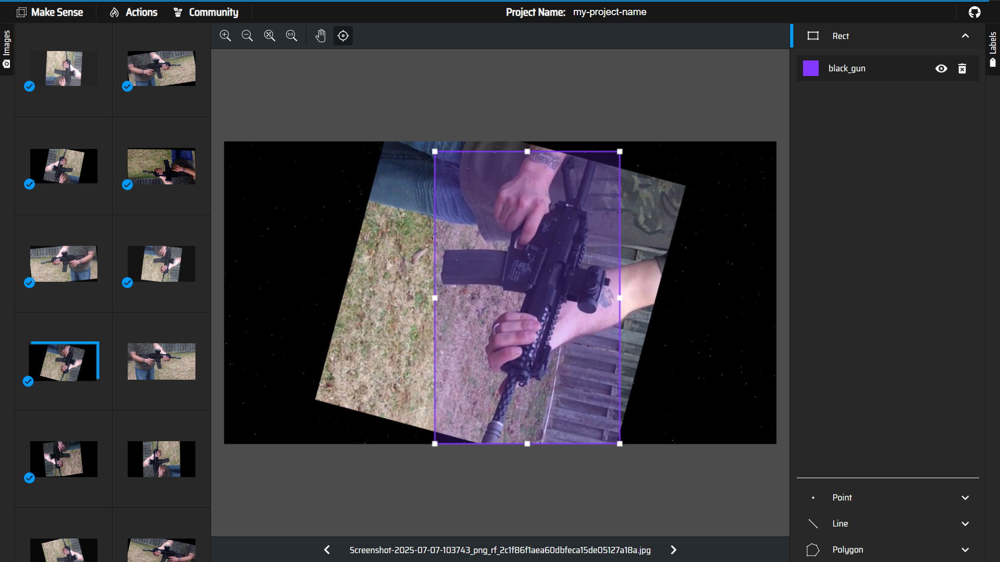

# Computer Vision Assessment: Black Gun Detection (KAC PDW)

## 📌 Project Overview

**Objective**: To prepare, train, and evaluate a computer vision model for detecting a **Black Gun (KAC PDW)**. This project compares the performance of models trained on **Synthetic Data (SD)** versus **Real Data**, and a combination of both.

**Duration**: 1 Week
**Model**: YOLO26n
**Key Deliverables**:

- Data Preparation & Isolation
- Model Training (SD, Real, Combined)
- Test Video Inference
- Comprehensive Reporting & Analysis

---

## 🚀 User Manual & How to Run

### 1. Prerequisites

- Python 3.8+
- GPU with CUDA support (recommended)
- Dependencies: `ultralytics`, `opencv-python`, `pandas`, `numpy`, `matplotlib`, `seaborn`, `mlflow`, `jupyter` or `notebook`

### 2. Installation

```bash
git clone https://github.com/arifsoul/gun_detection.git
cd gun_detection
pip install -r requirements.txt
```

### 3. Data Setup

- Place the datasets in the `data/` directory (or specify structure).
- Ensure `data.yaml` is configured correctly.

### 4. Training

The training process is consolidated in `training.ipynb`. This notebook handles:

1. **Data Preparation**: Merging datasets, fixing labels, splitting into Train/Val/Test, and generating `data.yaml`.
2. **Model Training**: Training yolo26n models (Real, Synthetic, Combined) with MLflow logging.
3. **MLflow Integration**: Experiments are tracked in `mlruns/`.

To train a model:

1. Open `training.ipynb`.
2. Configure the `selected_dataset` variable in the "Training" cell (e.g., `real`, `syn_v3`, `combined`).
3. Run all cells.

### 5. Evaluation

Model evaluation is handled in `evaluation.ipynb`. This notebook:

1. Loads the best models from successful MLflow runs.
2. Evaluates them on the isolated Test set.
3. Generates metrics (mAP, Confusion Matrix).

To evaluate:

1. Open `evaluation.ipynb`.
2. Run all cells.
3. View the aggregated results table and plots within the notebook.

### 6. Inference

Explain how to run inference on test videos:

```bash
# Run inference on a video file
python inference.py --source path/to/video.mp4 --weights path/to/best.pt --conf 0.5
```

- **Output**: Results are saved in `runs/detect/` (or specify location).

---

## 📊 Report & Analysis

### 1. Data Preparation & Isolation

#### 1.1 Datasets Overview

We utilize three primary datasets for this project, categorized into Synthetic and Real-world data:

- **VSD (Synthetic Data)**:
  - **Synthetic Dataset v2**: `synthetic_dataset_KAC_PDW_Blackgun_v2` (Used with manually fixed annotations).
  - **Synthetic Dataset v3**: `synthetic_dataset_KAC_PDW_Blackgun_v3` (Cleaner dataset, comprising `Dataset_0` and `Dataset_1`).
- **Real Data**:
  - **Real Dataset**: `real_dataset_KAC_PDW_Blackgun` (Captured from actual camera footage).

#### 1.2 Data Cleaning & Annotation

To ensure high-quality training data, we performed rigorous data cleaning and annotation:

1. **Manual Annotation & Validation**:

   - We manually reviewed all images and annotations.
   - **Synthetic v2**: Missing annotations were identified and added to a `labels_fix` directory.
   - **Real Dataset**: Similarly, specific real-world images lacking annotations were corrected.

   
   *Figure 1: Manual labelling and validation process for Synthetic Dataset v2.*

   
   *Figure 2: Manual labelling process for Real Dataset.*
2. **Removal of Invalid Data**:

   - We systematically removed invalid labels and erroneous object selections to prevent model confusion.

   
   *Figure 3: Deletion of invalid labels and object selections.*

#### 1.3 Data Splitting Strategy

We employed a **Stratified Random Split** strategy to ensure that the distribution of data across Train, Validation, and Test sets is representative of the overall dataset.

- **Split Ratios**:

  - **Train**: 70%
  - **Validation**: 20%
  - **Test**: 10%
- **Reproducibility**: A fixed random seed (`SEED = 42`) was used in `src/prepare_data.py` to ensure the split is deterministic and reproducible.

  
  *Figure 4: Distribution of images across Train, Validation, and Test splits for each dataset.*

#### 1.4 Dataset Inventory

A detailed inventory of the datasets (before and after fixing labels) is visualized below. This comparison highlights the significant effort put into correcting missing or incorrect annotations.


*Figure 5: Inventory of matched image-label pairs, comparing original vs. fixed annotations.*

#### 1.5 Strict Data Isolation

- **Test Set Integrity**: The Test set (10% of each dataset source) is **strictly isolated**. It is never seen by the model during the training or validation phases.
- **Ground Truth**: The isolated test sets serve as the independent Ground Truth for final model evaluation.

### 2. Model Training Strategy

We trained three variations of the model to compare performance:

1. **SD-Only**: Trained exclusively on Synthetic Data.
2. **Real-Only**: Trained exclusively on Real World Data.
3. **Combined**: Trained on both datasets.

#### Training Metrics Analysis

To understand the training dynamics and convergence of each model, we analyzed the training loss, validation loss, and mAP metrics. The following visualizations compare the performance of the **Synthetic-Only**, **Real-Only**, and **Combined** models throughout the training process.


*Figure 6: Comparison of Training Box, Objectness, and Classification Loss. Lower values indicate better fitting to the training data.*


*Figure 7: Comparison of Validation Loss. Consistently lower validation loss suggests better generalization and less overfitting.*


*Figure 8: Comparison of Mean Average Precision (mAP) metrics. Higher mAP@50 and mAP@50-95 indicate superior detection accuracy.*

### 3. Detection Accuracy & Performance Metrics

The model performance was evaluated using `yolo26n` on two criteria:

1. **Domain-Specific Performance**: Evaluating each model on its own corresponding Test Set.
2. **Universal Performance**: Evaluating all models on the **Combined Test Set** (acting as a Universal Ground Truth) to measure generalization.

#### 3.1 Domain-Specific Performance (Self-Evaluation)

*How well does the model learn its training domain?*

| Model Train Source      | Test Set                | Precision (P)   | Recall (R)      | mAP@50          | mAP@50-95       |
| :---------------------- | :---------------------- | :-------------- | :-------------- | :-------------- | :-------------- |
| **Real + Syn V3** | **Real + Syn V3** | **0.993** | **0.991** | **0.995** | **0.953** |
| Real + Syn V2           | Real + Syn V2           | 0.997           | 1.000           | 0.995           | 0.944           |
| Real                    | Real                    | 0.987           | 1.000           | 0.995           | 0.955           |
| Syn V3                  | Syn V3                  | 0.989           | 1.000           | 0.995           | 0.994           |
| Syn V2                  | Syn V2                  | 1.000           | 0.999           | 0.995           | 0.876           |

#### 3.2 Universal Performance (Generalization)

*How well does the model perform on the complete dataset (Real + All Synthetic)? This is the true test of robustness.*

| Model Train Source      | Precision (P)   | Recall (R)      | mAP@50          | mAP@50-95       | Confusion Matrix |
| :---------------------- | :-------------- | :-------------- | :-------------- | :-------------- | :--------------- |
| **Real + Syn V3** | **0.981** | **0.940** | **0.967** | **0.897** | [Link to Image]  |
| Real + Syn V2           | 0.994           | 0.976           | 0.994           | 0.793           | [Link to Image]  |
| Real                    | 0.954           | 0.877           | 0.941           | 0.633           | [Link to Image]  |
| Syn V3                  | 0.909           | 0.426           | 0.573           | 0.506           | [Link to Image]  |
| Syn V2                  | 0.789           | 0.500           | 0.580           | 0.265           | [Link to Image]  |

#### 3.3 Key Observations

1. **Best Generalization**: The **Real + Syn V3** model achieves the highest **mAP@50-95 (0.897)** on the universal test set, significantly outperforming other variants.
2. **Importance of Real Data**: Models trained purely on synthetic data (Syn V2, Syn V3) struggle to generalize to the full dataset (Recall drops below 50% for Syn V3).
3. **Data Quality Matters**: Synthetic V3 (when combined with Real data) contributes to a much stronger model than Synthetic V2, jumping from 0.793 to 0.897 in mAP@50-95.

### 4. Qualitative Analysis

#### Success Cases (Detection Found)

- **Screenshot 1**: [Insert Image] - *Description (e.g., Clear day, close range)*
- **Screenshot 2**: [Insert Image] - *Description (e.g., Obscured view)*

#### Failure Cases (False Negatives / False Positives)

- **Failure 1**: [Insert Image] - *Reason (e.g., Motion blur, low light, similar object)*
- **Failure 2**: [Insert Image] - *Reason (e.g., Occlusion)*

### 5. Comparative Analysis: Real vs. Synthetic vs. Combined

- **SD-Only vs. Real-Only**:

  - [Analysis: Did the synthetic model generalize to real world?]
  - [Highlight differences in confidence scores and bounding box stability]
- **Bonus Comparison (VSD v2 vs. VSD v3)**:

  - [Did the cleaner VSD v3 improve results over v2?]

### 6. Robustness & Environmental Analysis

- **Lighting Conditions (Day vs. Night)**:

  - **Day Mode**: [Comments on performance]
  - **Night Mode**: [Comments on performance]
- **Real Test Video Performance**:

  - [Specific challenges observed in the real test videos]

### 7. Synthetic Data Viability Analysis

**Question**: *Can synthetic datasets be used effectively instead of real datasets?*

**Answer/Analysis**:

- **Quality of Synthetic Data**: [Comment on texture, lighting, physics of SD]
- **Conclusion**: [YES/NO].
- **Reasoning**:
  - [Point 1: e.g., "SD helps initializing learning but lacks domain gap coverage..."]
  - [Point 2: e.g., "Effective for rare edge cases but needs real data for fine-tuning..."]
  - [Convincing Argument]: [Draft your argument here based on results]

---

## 🌟 Bonus Features

### Object Tracking

- Implemented simple object tracking (e.g., "Weapon ID 01") across frames.
- [Briefly explain implementation method, e.g., SORT, DeepSORT, or simple centroid tracking]

### Robustness Test (2h Pre-Release Video)

- **Scenario**: Video released 2 hours before review.
- **Results**: [Report findings here on the fly]

---

## 🔮 Future Improvements

### Generative AI for Synthetic Data Creation

We propose leveraging advanced **3D Generative AI** to revolutionize synthetic dataset creation, overcoming the limitations of traditional 2D data augmentation.


*Figure 9: Demonstration of generating a 3D model of a person holding a KAC PDW from a single 2D image using Hunyuan 3D.*

**Value Proposition:**

- **Realistic 3D Asset Creation**: Tools like **Hunyuan 3D** can convert single 2D reference images into high-fidelity 3D meshes with textures.
- **Infinite Variations**: Once a 3D asset is created, we can generate infinite variations in looking angles, lighting conditions, and background environments.
- **Cost-Effective Scaling**: Significantly reduces the need for manual 3D modeling or expensive real-world data collection.

**Proposed Workflow & Tools:**

1. **Hunyuan 3D** (or similar Image-to-3D AI): To generate the base 3D mesh and texture from reference images.
2. **Blender / Unreal Engine 5**: For rigging, animating, and placing the 3D assets into diverse high-quality scenes.
3. **Python Scripting**: To automate the rendering of thousands of labeled images with perfect ground truth bounding boxes.

---

## 📂 Project Structure

```
├── data/
├── docs/
├── mlruns/
├── src/
│   ├── dataset.py
│   ├── mlflow_utils.py
│   ├── prepare_data.py
│   └── utils.py
├── evaluation.ipynb
├── training.ipynb
├── inference.py
├── requirements.txt
├── README.md
└── ...
```
