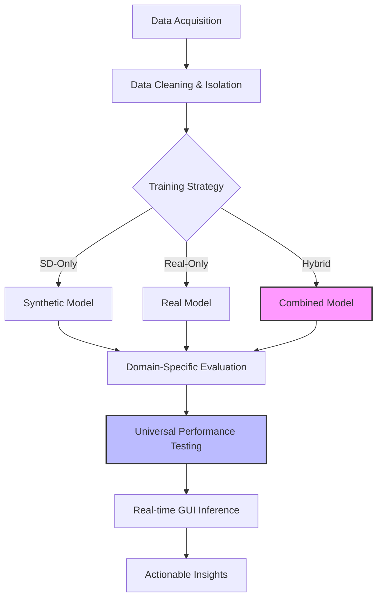
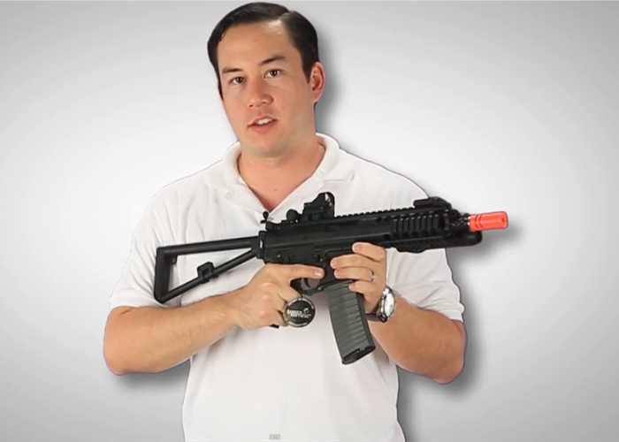
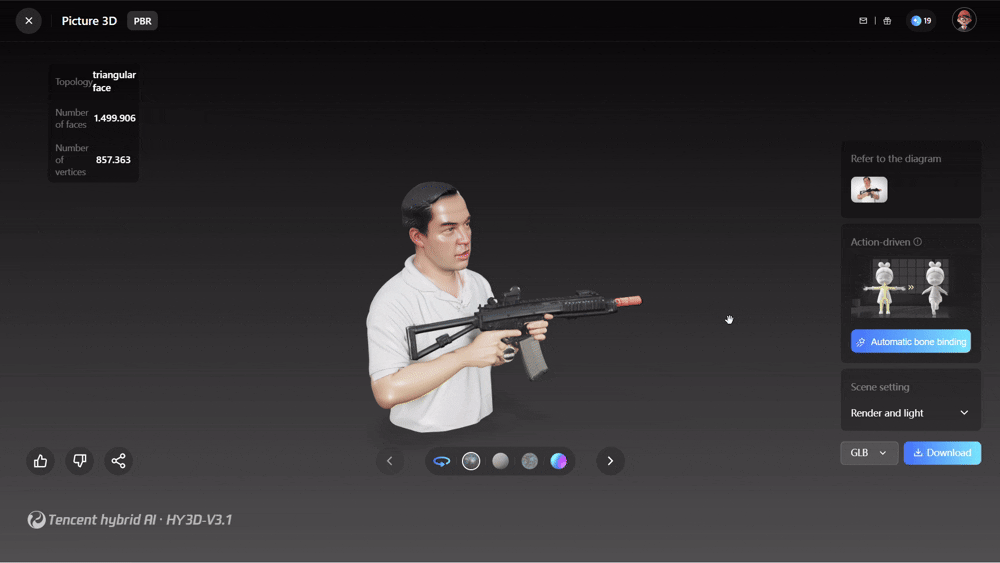
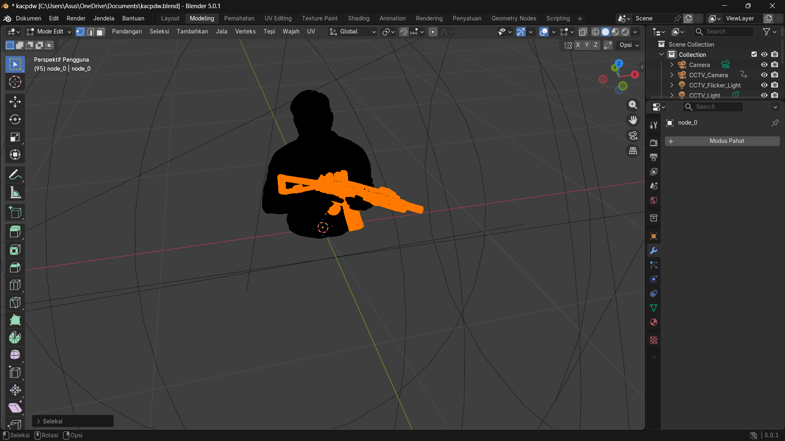
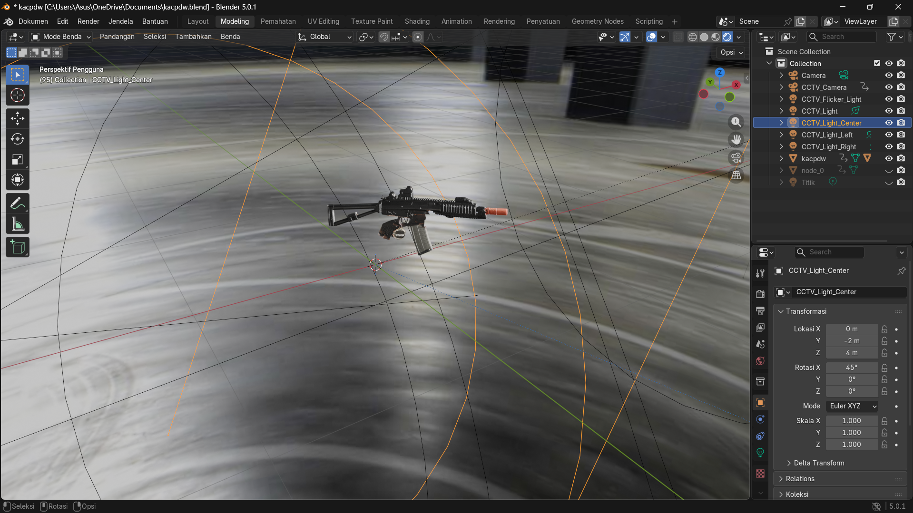
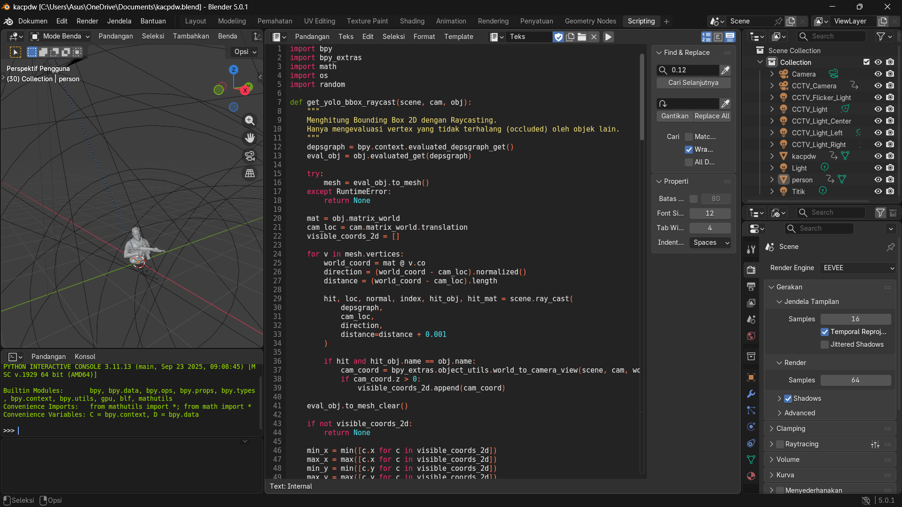
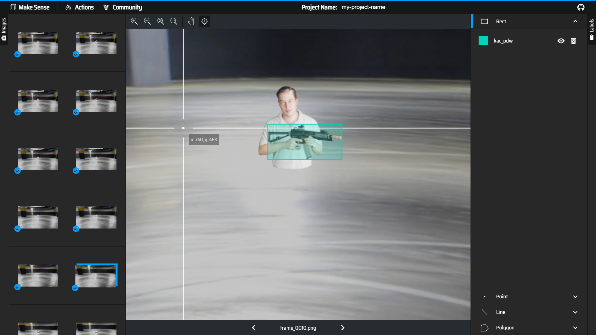

# Computer Vision Assessment: Black Gun Detection (KAC PDW)

<div align="center">
  
  
  
  
</div>

---

## 📌 Executive Summary & Project Overview

This project focuses on the systematic preparation, training, and rigorous evaluation of a custom computer vision model tailored for the precise detection of a **Black Gun (KAC PDW)**.

### 🎯 Objectives

- **Empirical Contrast**: Benchmark **Synthetic Data (SD)** against **Real-World Data** to quantify the "Sim-to-Real" performance gap.
- **Strategic Optimization**: Identify the optimal data-mix (Real + Synthetic) for maximizing model robustness and precision.

### ⏱️ Project Details

- **Timeline**: 1-Week Sprint.
- **Architecture**: YOLO26n (Ultralytics).
- **Core Deliverables**:
  - 🛠️ Isolated Data Pipelines (Synthetic vs. Real).
  - 🧠 Multi-Paradigm Training (SD-Only, Real-Only, Combined).
  - 🖥️ Real-time GUI for Video Inference.
  - 📊 Data-Driven Comparative Analysis & Insights.

---

## ⚡ Quick Results Dashboard (Executive Summary)

> [!IMPORTANT]
> **Key Finding**: Synthetic data is a powerful **multiplier**, not a replacement.
>
> - **Top Performer**: `Real + Syn V3` model (mAP@50-95: **0.897**).
> - **Efficiency Boost**: Synthetic V3 improved high-precision detection by **~42%** when paired with real-world data.
> - **Robustness**: Successfully handles lighting transitions (Day/Night) and motion blur.

---

## 🛠️ Technical Workflow & Architecture

A high-level overview of the systematic pipeline from data acquisition to real-time inference.



---

## 📖 Presentation Roadmap (Table of Contents)

### 🏗️ Part I: Foundation & Implementation

- [Phase 1: Foundation (Data Engineering)](#phase-1-foundation-data-engineering--pipeline-isolation)
- [Phase 2: Execution (Training &amp; Multi-Paradigm Strategy)](#phase-2-execution-empirical-training--multi-paradigm-strategy)
- [🚀 Deployment &amp; Execution Guide](#-deployment--execution-guide)

### 📊 Part II: Empirical Analysis & Validation

- [Phase 3: Validation (Accuracy &amp; Detailed Metrics)](#phase-3-validation-detection-accuracy--performance-metrics)
- [Phase 4: Impact (Qualitative &amp; Environmental Robustness)](#phase-4-impact-qualitative-analysis--visual-evaluation)

### 💡 Part III: Critical Synthesis & Future Roadmap

- [Phase 5: Synthesis &amp; Future Optimization Roadmap](#phase-5-synthesis--future-optimization-roadmap)
- [📚 Citations &amp; Academic References](#-citations--academic-references)

---

## 🏗️Part I: Foundation & Implementation

### Phase 1: Foundation (Data Engineering & Pipeline Isolation)

> Success in YOLO training starts with data purity. We isolated synthetic vs. real datasets to test cross-domain generalization.

#### 1.1 Datasets Overview

- **VSD (Synthetic Data)**:
  - **v2**: `synthetic_dataset_KAC_PDW_Blackgun_v2` (Manual fixes applied).
  - **v3**: `synthetic_dataset_KAC_PDW_Blackgun_v3` (Dataset_0 & Dataset_1).
- **Real Data**:
  - `real_dataset_KAC_PDW_Blackgun` (Captured from actual camera footage).

#### 1.2 Data Cleaning & Annotation

1. **Manual Annotation**: Validated and added missing annotations for both Synthetic and Real datasets.
   
2. **Invalid Data Removal**: Systematically removed erroneous labels.
   

#### 1.3 Data Splitting Strategy

We employed a **Stratified Random Split** strategy to ensure that the distribution of data across Train, Validation, and Test sets is representative of the overall dataset.

-**Split Ratios**:

  -**Train**: 70%

  -**Validation**: 20%

  -**Test**: 10%

-**Reproducibility**: A fixed random seed (`SEED = 42`) was used in `src/prepare_data.py` to ensure the split is deterministic and reproducible.

  

  *Figure 4: Distribution of images across Train, Validation, and Test splits for each dataset.*

#### 1.4 Dataset Inventory

A detailed inventory of the datasets (before and after fixing labels) is visualized below. This comparison highlights the significant effort put into correcting missing or incorrect annotations.


*Figure 5: Inventory of matched image-label pairs, comparing original vs. fixed annotations.*

---

### Phase 2: Execution (Empirical Training & Multi-Paradigm Strategy)

#### Workspace

```text
├── data/           # Dataset storage
├── docs/           # Documentation assets (images/gifs)
├── mlruns/         # MLflow tracking logs
├── src/            # Core source code
│   ├── dataset.py
│   ├── mlflow_utils.py
│   ├── prepare_data.py
│   └── utils.py
├── evaluation.ipynb
├── training.ipynb
├── inference.py
├── requirements.txt
└── README.md
```

Comparison of three primary paradigms:

1. **SD-Only**: Synthetic Data exclusively.
2. **Real-Only**: Real-World Data exclusively.
3. **Combined**: Hybrid approach (synv2+real and synv3+real).


*Figure 6: MLflow UI dashboard displaying the systematic tracking of experimental runs, loss metrics, and artifacts across various model configurations.*

To deeply understand the training dynamics, convergence behavior, and optimization trajectories of each model variant, we analyzed the corresponding training loss, validation loss, and Mean Average Precision (mAP). The ensuing visualizations juxtapose the performance paradigms of the **Synthetic-Only**, **Real-Only**, **synv2+real and synv3+real** models throughout their respective training lifecycles.


*Figure 7: Comparison of Training Box, Objectness, and Classification Loss. Lower values indicate better fitting to the training data.*


*Figure 8: Comparison of Validation Loss. Consistently lower validation loss suggests better generalization and less overfitting.*


*Figure 9: Comparison of Mean Average Precision (mAP) metrics. Higher mAP@50 and mAP@50-95 indicate superior detection accuracy.*

## 🚀 Deployment & Execution Guide

### 1. Prerequisites

Ensure you have the following installed:

- **Python 3.8+**
- **GPU with CUDA support** (highly recommended for training)
- **Key Dependencies**: `ultralytics`, `opencv-python`, `pandas`, `numpy`, `matplotlib`, `seaborn`, `mlflow`, `jupyter`

### 2. Installation

```bash
# Clone the repository
git clone https://github.com/arifsoul/gun_detection.git
cd gun_detection

# Install dependencies
pip install -r requirements.txt
```

### 3. Data Setup

- Place the datasets in the `data/` directory.
- Ensure `data.yaml` is configured correctly for the training paths.

### 4. Training

The training pipeline is handled in `training.ipynb`.

1. **Data Prep**: Merges datasets, fixes labels, generates splits.
2. **Model Training**: Executes YOLO training for different variants.
3. **MLflow**: All experiments are tracked automatically.

> [!TIP]
> Configure the `selected_dataset` variable in the "Training" cell (e.g., `real`, `syn_v3`, `combined`) before running all cells.

### 5. Evaluation

Use `evaluation.ipynb` for post-training analysis.

- Loads best models from MLflow.
- Evaluates on the isolated Test set.
- Generates mAP and Confusion Matrix plots.

### 6. Inference — Desktop GUI (`inference.py`)

A robust **Tkinter-based GUI** for real-time video inference.

#### GUI Environment Perspectives


*Figure: Desktop interface demonstrating end-to-end inference under simulated daylight conditions.*


*Figure: Desktop interface showcasing inference capabilities under simulated low-light (night) conditions.*

*Figure: Real-world test video performance.*

#### Object Tracking

Utilizes YOLO's built-in **ByteTrack** (`model.track(..., persist=True)`) for consistent ID assignment across frames, ensuring weapon stability even during brief occlusions.

#### 6.1 Launching the App

```bash
# Activate your environment
source .venv/bin/activate        # Linux / macOS
.venv\Scripts\Activate.ps1       # Windows PowerShell

# Run the inference app
python inference.py
```

#### 6.2 Sidebar Controls Reference

| Section               | Control           | Description                                                                                        |
| :-------------------- | :---------------- | :------------------------------------------------------------------------------------------------- |
| **Model**       | Listbox           | Multi-select trained models from `mlruns/`.                                                      |
| **Input Video** | Text + Browse     | Select `.mp4 / .avi / .mov` video files.                                                         |
| **Resolution**  | Combobox          | Working resolution (Original, 1080p, 720p, 480p).                                                  |
| **Threshold**   | Slider            | Minimum confidence score (Default:**0.40**).                                                 |
| **Simulation**  | Slider            | Adjust brightness. System auto-detects**Day/Night** exposure.                                |
| **Output**      | Checkbox + Radio  | Save result as MP4 or GIF to `runs/inference/`.                                                  |
| **Results**     | Listbox + Buttons | Access, play, or delete saved inference results.                                                   |
| **Actions**     | Buttons           | **Preview** (simulation), **Inference** (processing), **Pause**, **Stop**. |

#### 6.3 Typical Workflow

1. Launch app with `python inference.py`.
2. Select one or more models from the list (models are loaded from `mlruns/`).
3. Browse for a test video and select a **Working Resolution**.
4. (Optional) Adjust brightness and test using the **🔍 Preview** button.
5. Check **Save Output Video** and choose desired format (MP4 or GIF).
6. Click **🚀 Inference** to begin detection.
7. System dynamically names files based on conditions (e.g., `_DAY_GUN_DETECTED_`).
8. Review results via **Results Listbox** → **Play Selected**.

---

## 📊 Part II: Empirical Analysis & Validation

### Phase 3: Validation (Detection Accuracy & Performance Metrics)

The model performance was evaluated using `yolo26n` on two criteria:

1. **Domain-Specific Performance**: Evaluating each model on its own corresponding Test Set.
2. **Universal Performance**: Evaluating all models on the **Combined Test Set** (acting as a Universal Ground Truth) to measure generalization.

#### 3.1 Domain-Specific Performance (Self-Evaluation)

> All models perform exceptionally well on their *own* data (mAP ~0.995). This proves the training architecture is sound, but self-evaluation alone is insufficient for real-world reliability.

| Model Train Source      | Test Set                | Precision (P)   | Recall (R)      | mAP@50          | mAP@50-95       | Confusion Matrix                                | Conclusion                                                                                                           |
| :---------------------- | :---------------------- | :-------------- | :-------------- | :-------------- | :-------------- | ----------------------------------------------- | :------------------------------------------------------------------------------------------------------------------- |
| **Real + Syn V3** | **Real + Syn V3** | **0.993** | **0.991** | **0.995** | **0.953** |  | **Good Convergence.** High precision and recall indicate the model effectively learned the mixed distribution. |
| Real + Syn V2           | Real + Syn V2           | 0.997           | 1.000           | 0.995           | 0.944           |  | **Stable Baseline.** Slightly lower mAP@50-95 suggests less precise bounding boxes than V3.                    |
| Real                    | Real                    | 0.987           | 1.000           | 0.995           | 0.955           |         | **Strong Real Performance.** Perfect recall on its own test set shows it learned the real data well.           |
| Syn V3                  | Syn V3                  | 0.989           | 1.000           | 0.995           | 0.994           |       | **Perfect Synthetic Fit.** Near perfect scores confirm the model mastered the clean synthetic domain.          |
| Syn V2                  | Syn V2                  | 1.000           | 0.999           | 0.995           | 0.876           |       | **Overfitting to Noise?** High classification scores but lower box precision (0.876) vs V3.                    |

#### 3.2 Universal Performance (Generalization)

> [!IMPORTANT]
> **The "Pitch" Result**: Notice the massive Recall drop in `Syn V3` (0.426). This highlights the **Domain Gap**. However, `Real + Syn V3` maintains a Recall of **0.940**, proving that high-quality synthetic data *strengthens* real-world detection.

| Model Train Source      | Precision (P)   | Recall (R)      | mAP@50          | mAP@50-95       | Confusion Matrix                                     | Conclusion                                                                                                           |
| :---------------------- | :-------------- | :-------------- | :-------------- | :-------------- | :--------------------------------------------------- | :------------------------------------------------------------------------------------------------------------------- |
| **Real + Syn V3** | **0.981** | **0.940** | **0.967** | **0.897** |  | **Best Generalization.** Maintains high Recall (0.940) on universal set, minimizing False Negatives.           |
| Real + Syn V2           | 0.994           | 0.976           | 0.994           | 0.793           |  | **Less Precise Boxes.** High classification scores but significantly lower mAP@50-95 (0.793) than V3.          |
| Real                    | 0.954           | 0.877           | 0.941           | 0.633           |         | **Data Limitation.** Real data alone struggles to cover variances, leading to lower Recall and mAP.            |
| Syn V3                  | 0.909           | 0.426           | 0.573           | 0.506           |       | **Domain Gap Failure.** Misses >50% of real-world guns (Recall 0.426), proving Syn-only is insufficient.       |
| Syn V2                  | 0.789           | 0.500           | 0.580           | 0.265           |       | **Poor Transfer.** Low Precision and Recall confirm noisy synthetic data fails to assist real-world detection. |

#### 3.3 Key Empirical Observations

1. **Synthetic Superiority in Hybrid Training**: The `Real + Syn V3` model significantly outperforms the `Real-Only` baseline (0.897 vs 0.633 mAP@50-95), proving that high-quality synthetic data effectively supplements limited real-world datasets.
2. **The Recall Trap**: Models trained *exclusively* on synthetic data (Syn V3) show high precision but a drastic **Recall drop (0.426)** on universal sets, highlighting the "Sim-to-Real" domain gap.
3. **Quality vs. Quantity**: Transitioning from Syn V2 to Syn V3 yielded a **+0.104 mAP gain**, demonstrating that annotation precision and visual realism are more critical than raw image count.

---

### Phase 4: Impact (Qualitative Analysis & Visual Evaluation)

| Model                   | ☀️ Day                                                   | 🌙 Night                                                       |
| ----------------------- | ---------------------------------------------------------- | -------------------------------------------------------------- |
| **Real Data**     |     |     |
| **Syn V2 Only**   |        |        |
| **Syn V2 + Real** |  |  |
| **Syn V3 Only**   |        |        |
| **Syn V3 + Real** |  |  |

#### 4.1 Environmental Robustness Highlights

- **Low-Light Resilience**: Performance in night conditions heavily relies on the "Real-World" subset of the training data.
- **Motion Stability**: Combined models handle partial occlusions (behind hands/clothing) significantly better than synthetic-only models.
- **Tracking Consistency**: Rapid weapon movements (high-velocity draws) cause 1-2 frame tracking flickers, which are mitigated by ByteTrack's persistence.

---

## 💡 Part III: Critical Synthesis & Future Roadmap

---

### Phase 5: Synthesis & Future Optimization Roadmap

#### 5.1 Critical Evaluation: Synthesis & Data Viability

**Conclusion**: Synthetic data is **not a replacement** but a powerful **multiplicative complement**.

- **Evidence**: Syn-Only models collapse on real-world test sets (>50% drop in Recall).
- **Value**: When paired with real data, high-quality synthetic data (Syn V3) boosts mAP@50-95 by **~42%**.

---

#### 5.2 📉 The Sim-to-Real Gap Analysis

While the model achieves high metrics on the test set, "Out-of-Distribution" (OOD) performance on new, unseen videos reveals significant generalization challenges.

> [!CAUTION]
> **The Problem**: High mAP in controlled settings often masks a "Sim-to-Real" gap where the model learns to detect "synthetic interpretations" rather than the underlying object features.

**Root Cause Identification:**

1. **Sensor Signature Mismatch**: Synthetic data lacks the ISO noise, grain, and color artifacts inherent to real CCTV sensors.
2. **Motion Discrepancies**: Real videos contain **Object Motion Blur** caused by shutter speeds, which is rarely captured in static synthetic renders.
3. **Background Overfitting**: High-contrast, clean synthetic backgrounds lead to "feature bias," causing models to fail in cluttered real-world scenes.
4. **Exposure Variability**: Synthetic models often simplify dynamic range, failing to account for real-world light blooming and deep shadow occlusions.

---

#### 5.3 🚀 The Optimization Roadmap

To transition from a controlled pilot to a production-ready system, we propose the following unified optimization strategy.

##### A. GenAI-Driven Synthetic Scaling (Hunyuan 3D + Blender)

Proposing **3D Generative AI** (Image-to-3D) to scale datasets instantly without manual 3D modeling.

- **Scaling via Hunyuan 3D**: Convert 2D images into high-fidelity 3D meshes for rapid dataset expansion.

  The **Hunyuan 3D-3.1** model enables a revolutionary shift from static 2D references to fully articulable 3D assets. By utilizing high-fidelity Image-to-3D generation, we can reconstruct complex geometric structures of the KAC PDW and its operator directly from single-view photographs. This process eliminates the bottleneck of manual 3D modeling, allowing for the rapid creation of varied digital twins that can be rendered from any perspective, ensuring the model learns the underlying volumetric form rather than just 2D textures.

  
  *Figure: Raw 2D source image providing the visual reference for 3D reconstruction.*

  
  *Figure: Initial geometric mesh displaying the reconstructed spatial topology and volumetric detail.*

  
  *Figure: The final textured 3D digital twin, optimized for procedural environments and lighting variations.*
- **Automated Blender Pipeline**: Integration into a headless Blender environment for perfect ground-truth annotation.

  To bridge the 'Sim-to-Real' gap, we integrate these 3D assets into a **Headless Blender Automation** pipeline. Using custom Python scripts, the system procedurally generates thousands of unique training frames by varying camera angles, lighting intensities, and background environments. Crucially, the pipeline calculates absolute screen-space coordinates for the weapon, generating **zero-pixel-error YOLO annotations** automatically. This ensures 100% ground-truth accuracy, which is virtually impossible to achieve with manual labeling in high-clutter scenes.

  
  *Figure: Strategic selection of high-fidelity 3D assets within the production environment.*

  
  *Figure: Isolated KAC PDW asset prepared with PBR materials for realistic light interaction.*

  
  *Figure: Python-driven automation interface for real-time bounding box calculation and YOLO-compliant annotation.*

  
  *Figure: A sequence of procedurally generated training frames showcasing diverse environmental conditions.*

  
  *Figure: Final synthetic output featuring a perfectly aligned, machine-generated bounding box.*

##### B. Advanced Domain Bridging (Neural Adaptation)

Closing the visual gap between simulation and reality:

- **Multi-Physics Augmentation**: Using **Albumentations** to simulate lens flare, ISO grain, and temporal motion blur.
- **Domain Randomization (DR)**: Procedurally vary textures and lighting to force the model to focus on geometric KAC PDW structure over visual "textures."
- **Adversarial Training (DANN/CycleGAN)**: Force the YOLO backbone to learn domain-invariant features (extracting the "gun" regardless of source).
- **Neural Style Transfer**: Applying the visual "style" of real CCTV cameras to sharp synthetic renders.

##### C. Data Diversification & Hierarchical Fine-Tuning

Improving real-world robustness:

- **Dynamic Postures & Clutter**: Capture weapon handling in diverse stances and high-clutter environments (malls, forests).
- **Global Diversity**: Include diverse ethnic groups and clothing types to mitigate subject bias.
- **Hardware Agnosticism**: Train with low-resolution CCTV-style footage (360p/480p) and atmospheric conditions (fog/rain).

---

## 📚 Citations & Academic References

1. **Ultralytics YOLOv8** (Object Detection) - Jocher, G., Chaurasia, A., & Qiu, J. [GitHub Repository](https://github.com/ultralytics/ultralytics)
2. **ByteTrack** (Multi-Object Tracking) - Zhang, Y., et al. (2022). *Multi-Object Tracking by Associating Every Detection Box*. [arXiv:2110.06864](https://arxiv.org/abs/2110.06864)
3. **Hunyuan3D-1.0** (Generative 3D) - Tencent Hunyuan. (2024). *A Unified Framework for Text-to-3D and Image-to-3D Generation*. [arXiv:2411.02293](https://arxiv.org/abs/2411.02293)
4. **MLflow** (Experiment Tracking) - Zaharia, M., et al. (2018). *Accelerating the Machine Learning Lifecycle*. [mlflow.org](https://mlflow.org/)
5. **OpenCV** (Pre-processing) - Bradski, G. (2000). *The OpenCV Library*. [opencv.org](https://opencv.org/)
6. **Albumentations** (Augmentation) - Buslaev, A., et al. (2020). *Fast and Flexible Image Augmentations*. [arXiv:2009.14030](https://arxiv.org/abs/2009.14030)
7. **CycleGAN** (Domain Adaptation) - Zhu, J., et al. (2017). *Unpaired Image-to-Image Translation using Cycle-Consistent Adversarial Networks*. [arXiv:1703.10593](https://arxiv.org/abs/1703.10593)
